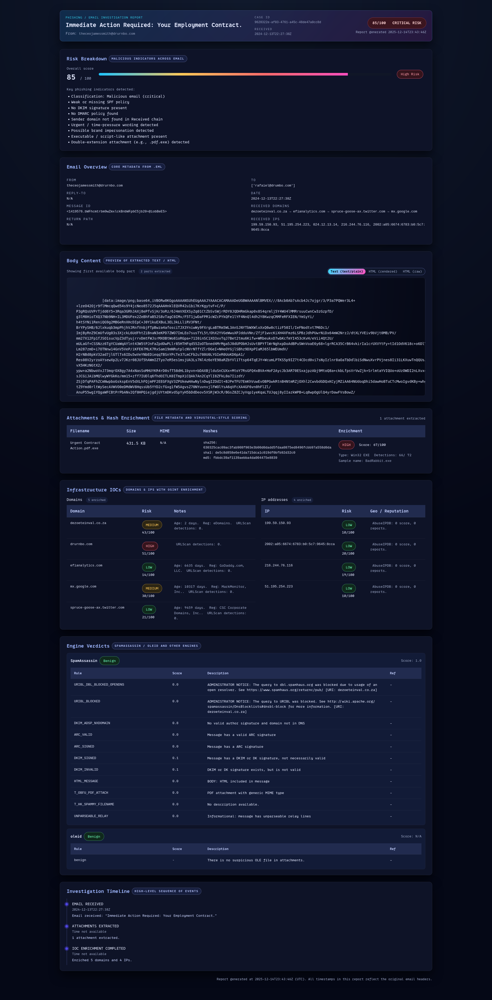
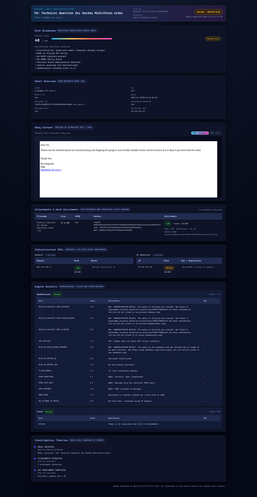
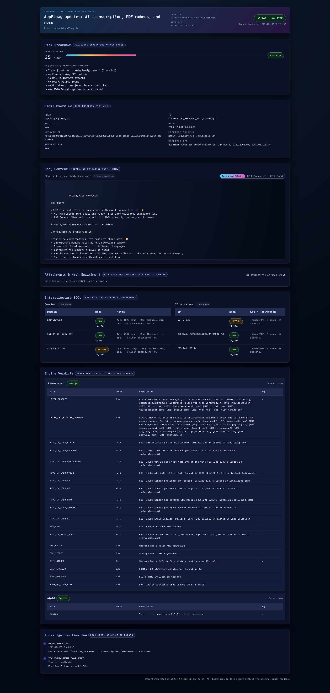

# SOC Enrichment & Automation Engine

A lightweight, modular SOC enrichment platform that automates IOC triage, phishing email analysis, and event-driven alerting. Built as a fast, extensible backend layer between SIEM alerts and analyst decision-making.

---

## Vision
Create a **minimal, intelligent SOC automation engine** that enriches IOCs at scale, prioritizes alerts with risk scoring, and accelerates phishing analysis—without becoming a full SIEM or SOAR.

---

## What’s Implemented

### ✅ IOC Enrichment Engine (core)
- IP, domain, and hash enrichment pipelines
- Multi-source intelligence (e.g., AbuseIPDB, IPInfo, DNS, VirusTotal)
- Normalized response models + unified risk scoring
- Batch enrichment support for event pipelines

### ✅ Phishing Email Analysis
- EML parsing and normalization
- Header/body/attachment extraction
- IOC extraction + enrichment
- Risk scoring and HTML report generation

### ✅ Event Ingestion & Correlation
- Ingest normalized events
- IOC enrichment + threat-intel context injection
- Correlation engine (rule-based)
- Alert dispatch hooks

---

## End Product (Planned)

### 🚧 UI + Analyst Workflow
A minimal web UI designed for rapid analyst workflows:
- **Upload EML** to generate a risk confidence report + enriched IOCs
- **IOC textbox enrichment** for quick manual triage
- **Local IOC lookup** from our internal database
- **Report generation** with risk scoring and decision context

### 🚧 Alerting & Automation
- Severity-based routing to **Slack, Discord, n8n, email**
- Structured summaries + full report attachments

### 🚧 Final polish
- Expanded TI sources (URL enrichment, URLScan, etc.)
- Refined scoring models + better error handling
- Production-ready configs

---

## Example Screenshots and HTML reports available in assets directory

--

## Scope Boundaries
**This is not** a SIEM, SOAR, or incident management platform. The goal is a focused enrichment + triage layer that complements existing tooling.

---

## Tech Stack
- **FastAPI** (backend API)
- **SQLAlchemy + Alembic** (persistence)
- **Pydantic** (validation)
- **Jinja2** (email report rendering)

---

## Status
- **IOC Enrichment Engine:** ~85%
- **Phishing Email Analysis:** ~75–80%
- **Alerting & Routing Layer:** In progress

---

## License
MIT
